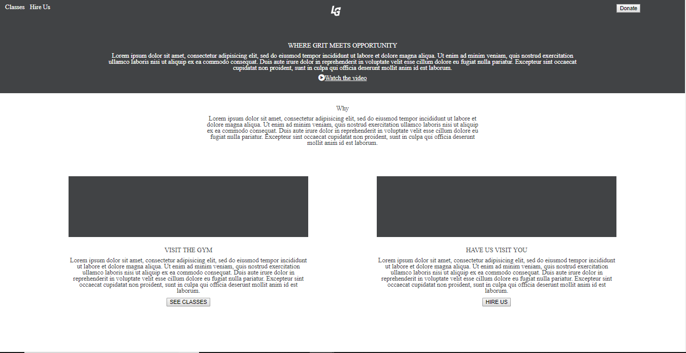

# My Awesome Level Ground
Level Ground's website has been recreated, fully responsive using HTML and CSS.

## How It's Made:

**Tech used:** HTML, CSS

In the project I mimicked the original Level Ground site to the bets of my abilities. I chose and placed content using HTML, and rearranged the content and styled using CSS.

## Lessons Learned:

During the construction of this webpage, I learned how to make content decisions for my media queries. Making sure to prioritize certain things on the webpage and making sure by the mobile size only the most important content remained.
